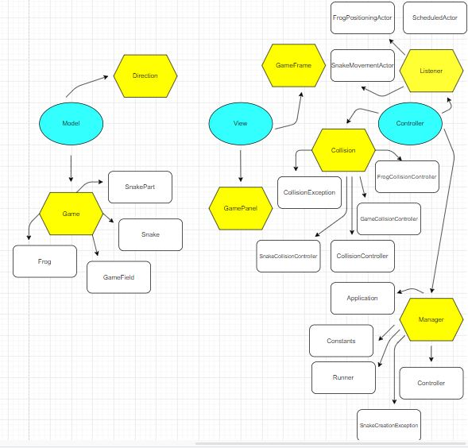

# DebugDataBandits - Arcade

## Summary

The Arcade Project aims to allow a User to play various games for entertainment on a Web Server. The User will be able to interact with the programs via a multitude of buttons, mouse movements, arrow keys, etc. Some of these games include Snake, TicTacToe, Tetris, Egyptian Card Slap, & more. Additionally, the User will be able to collect "Coins" for winning certain games to buy various different prizes.

## Instructions for Running

- Pull this repository from the "Main" branch.
- Travel to SRC/Main/Java.
- Here, each game is split into a different Package.

## Instructions for Each Game

###### HOW TO PLAY 2048 GAME

- 2048 presents with with a 4×4 grid. When you start the game, there will be two “tiles” on the grid, each displaying the number 2 or 4. 
- You hit the arrow keys on your keyboard to move the tiles around — and also to generate new tiles, which will also be valued at 2 or 4.
- When two equal tiles collide, they combine to give you one greater tile that displays their sum.
- The more you do this, obviously, the higher the tiles get and the more crowded the board becomes.
- Your objective is to reach 2048 before the board fills up.

###### HOW TO PLAY SNAKE GAME

- The player moves a snake around a grid utilizing the arrow keys, with movements in the upward, downward, left, & right directions.
- The player needs to move the snake so that it "eats the food" by touching the blue block on the grid.
- The "food" is considered eaten when the front of the snake touches the blue block.
- Each time the snake "eats the food", a new blue block is generated in another spot on the grid, which the snake has to "eat". Additionally, each time the snake "eats the food", the snake lengthens.
- The objective of the Snake Game is to get the snake to be as long as possible.
- The score is the amount of "food" that's eaten by the snake. This is kept track of in the "run window" in IntelliJ.

## Work for Week 7

###### Aditya Surapaneni

- Click on this [link](https://drive.google.com/file/d/17y1B-VN6N9yavHkoa137qIdPxo7I_Ovl/view?usp=sharing) to access an MVC diagram I created to plan out the Snake Game.
- Or, just look at the picture below.
- 
- Here's a [link](https://github.com/AdityaS1426/DebugDataBandits-Arcade/issues) to the code for the SnakeGame with explanations. Note that the SnakeGame doesn't run since it's being designed around the Main Class, which will be created at the end.
- However, I have finished making a [2048 Game](https://github.com/AdityaS1426/DebugDataBandits-Arcade/tree/main/SRC/Game) that runs. I started this over the summer, but finished it this week. This game has various components that are the same as which I will use in the SnakeGame, so I'm using this for inspiration, as well as a basis/reference for my SnakeGame code. TO RUN THIS PROGRAM, PULL THE REPO. GO TO SRC/GAME/GAMEGUI. Run this to play the game.

###### Jacob Rozenkrants
- Continue working on Easter Egg.
- Will be able to access past documents and group work.
- Continue working on Snake Game.
- Here's a [link](https://github.com/AdityaS1426/DebugDataBandits-Arcade/issues) to the code for the SnakeGame with explanations. Note that the SnakeGame doesn't run since it's being designed around the Main Class, which will be created at the end.

###### Atharva Kudrimoti
- Began work on Tic Tac Toe Game. (Code is located in SRC.)
- This correlates to what I had set as a goal for my ticket last week.
- I have not figured out how to implement into web-based programing but that will be my goal for next week.
- Boolean Statements are used to control the AI and for loops for user input.

###### Arnav Swami
- Continue working on my Egyptian Ratslap Game.
- Ratslap Game does not run but I will be able to make it run soon.
- The Ratslap Game runs around other intertwined classes which will be coded later.

## General Plan for Week 6

- Team members should get familiarized with Spring, Spring Boot, & Thymeleaf.
- Team members should get familiarized with HTML.
- Team members should plan out their contribution to the Arcade Project.
- Team members should start working on Arcade Project.

## Tickets for Each Team Member

###### Aditya Surapaneni

- Create a diagram to plan an MVC approach to the Snake Game.
- Conduct research on how to implement Snake Game into web-based server using CSS, HTML, & JS.
- Start coding the Snake Game based on the MVC diagram; not expected to get too far into coding due to limited familiarity with Spring.
- Decide on whether Raspberry Pi, Virtual Box, or AWS works best with Arcade Project.
- As Scrum Master, ensure that the team understands how to implement the Arcade Project into Spring, CSS, HTML, JS, etc.

###### Atharva Kudrimoti

- Plan out logic for Tic Tac Toe game through Model-View-Control format.
- Become familiar with Spring, CSS, HTML, JS through resources like YouTube.
- Find out how to code games in general. (How to computationally think.)
- Begin coding Tic Tac Toe game.

###### Jacob Rozenkrants

- Create a diagram to plan an MVC approach for Easter Egg.
- Easter Egg will include links to FRQs, old repositories, etc.
- Research how to write HTML, CSS, and JS.
- Begin coding for the Easter Egg.
- Determine whether to use Raspberry Pi, Virtual Box, or AWS (Group Decision)

###### Arnav Swami

- Make the diagram to plan out logic for Egyptian Rat slap. 
- Do research on web based servers and how I 
   can incorporate the RatSlap game using HTML 
   and CSS as it was shown in the presentation.
- Get comfortable with CSS, HTML, Spring by using online 
   resources.
 - Decide on AWS, Raspberry Pi, or Virtual Box which will 
   work best for our arcade project.

